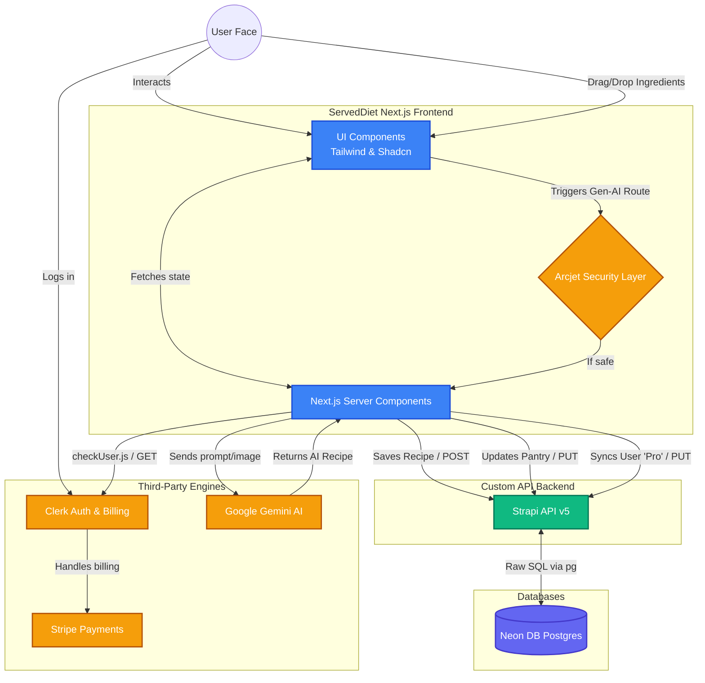

# ServedDiet Project Architecture

Based on a deep scan of the codebase (both `frontend` and `backend` directories), here is the comprehensive architectural overview of the application, detailing every library, language, route structure, and the exact flow of data.

---

## 1. Core Languages
- **JavaScript (JS/JSX)**: Used throughout the entire project (both Next.js Frontend and Strapi Node.js Backend).
- **CSS**: Tailwind post-processing injected into global stylesheets.
- **SQL (PostgreSQL)**: The relational database dialect used behind the scenes.

---

## 2. The Frontend (Next.js 16 App Router)

The frontend is a modern React application utilizing Server and Client components perfectly to optimize rendering. 

### Key Libraries & Their Purpose
*   **Next.js (v16.2)**: The core React framework managing Server-Side Rendering (SSR) and Server Actions.
*   **Tailwind CSS (v4)**: Your styling engine. Handles all responsive design and utility classes natively via PostCSS.
*   **Clerk (`@clerk/nextjs`, `@clerk/ui`, `@clerk/themes`)**: Complete Identity provider. It provides the pre-built Sign-In models, the User drop-down UI, and the Stripe `<PricingTable>` component for "Pro Chef" billing.
*   **Shadcn/UI & Radix UI**: High-quality, accessible UI components. You have beautifully composed pieces (Dialogs, Modals, Badges) sitting on top of Radix's headless un-styled accessible primitives.
*   **Google Generative AI (`@google/generative-ai`)**: The Gemini API package! You use this to dynamically take pantry ingredients and intelligently generate brand-new cooking recipes via AI.
*   **Arcjet (`@arcjet/next`)**: A security layer sitting on your Next.js Edge infrastructure. It protects your expensive AI API routes from bot abuse and rate-limits users.
*   **React Dropzone**: Likely used in your `/pantry` or `/recipe` routes to allow users to drag-and-drop pictures of their fridge/receipts to automatically extract ingredients.
*   **Sonner**: The incredibly sleek toast notification system for success/error messages.
*   **Lucide React**: The unified icon library (like the refrigerator or chef hat icons!).

### Directory & Route Flow
Based on the `app/(main)` and `app/(auth)` folders, the router structure provides:
- `/sign-in` & `/sign-up`: Authenticated layout solely for Clerk flows.
- `/dashboard`: The main hub checking the user status and showing their overall stats.
- `/pantry`: A management page where the user keeps track of their available ingredients.
- `/recipes`: The master list of all recipes requested or saved.
- `/recipe` (Dynamic): The layout to view a single detailed recipe.

---

## 3. The Backend (Strapi v5 + Neon DB)

The backend acts as the single source of truth for saving user-generated content natively, independent of Clerk.

### Key Libraries
*   **Strapi (v5.40)**: The headless Node.js CMS that instantly spins up REST API endpoints. Uses custom Node DNS flags to bypass IPv6 connection timeouts for local Windows development.
*   **pg (PostgreSQL client)**: Drives the direct connection engine connecting Strapi to the serverless **Neon DB** in the cloud.

### Data Models (`backend/src/api/`)
The Strapi schema consists of four primary internal entities logic:
1.  **Users** (Partially maintained by Clerk via backend syncing logic in `checkUser.js`).
2.  **PantryItem**: Tracks an individual ingredient, its quantity, and an owner reference back to a User.
3.  **Recipe**: Detailed storage for an AI-generated food recipe (ingredients, instructions, nutrition).
4.  **SavedRecipe**: A relational "join table" item that lets a User bookmark a specific Recipe for later viewing.

---

## 4. Elaborate System Flow Diagram

Here is exactly how Data, Users, AI, and Money flow through the system:

## Summary of the "Magic Moment"
When a user wants an AI recipe:
1. They arrive on the site and are securely authenticated by **Clerk**.
2. They visit `/pantry` and upload/type their ingredients (prevented from spamming the system by **Arcjet**).
3. The server takes those items and asks **Google Gemini AI** to hallucinate a delicious recipe based off their pantry.
4. Next.js creates the recipe UI on the fly, and fires a background REST API POST request to **Strapi**, permanently saving that recipe into your **Neon DB**.
5. If the user likes it, they click "Save", which fires an API to write a `saved-recipe` relation linking their User ID to the physical Recipe ID in Neon DB!
